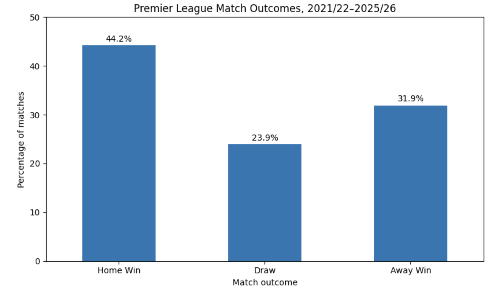
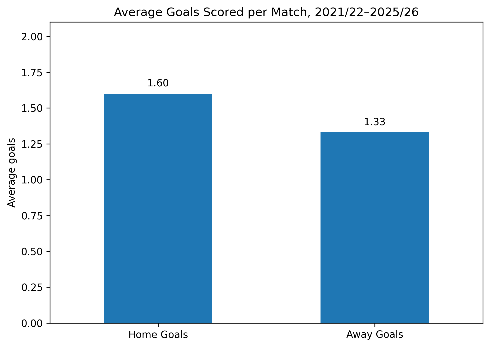
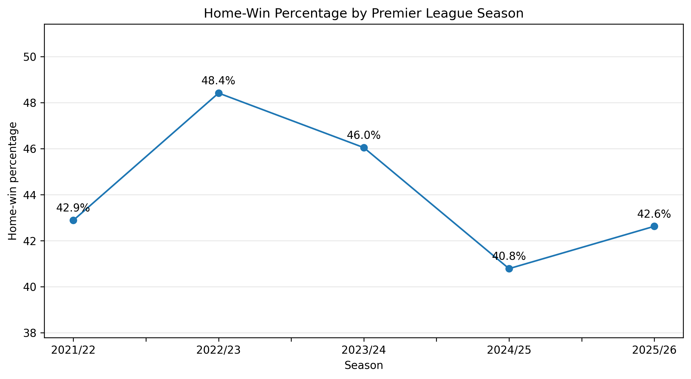
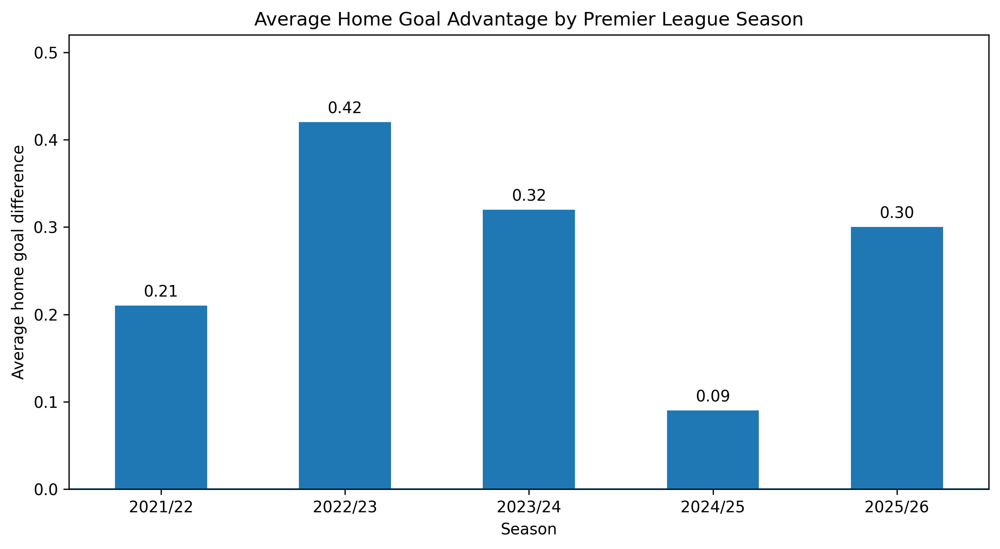
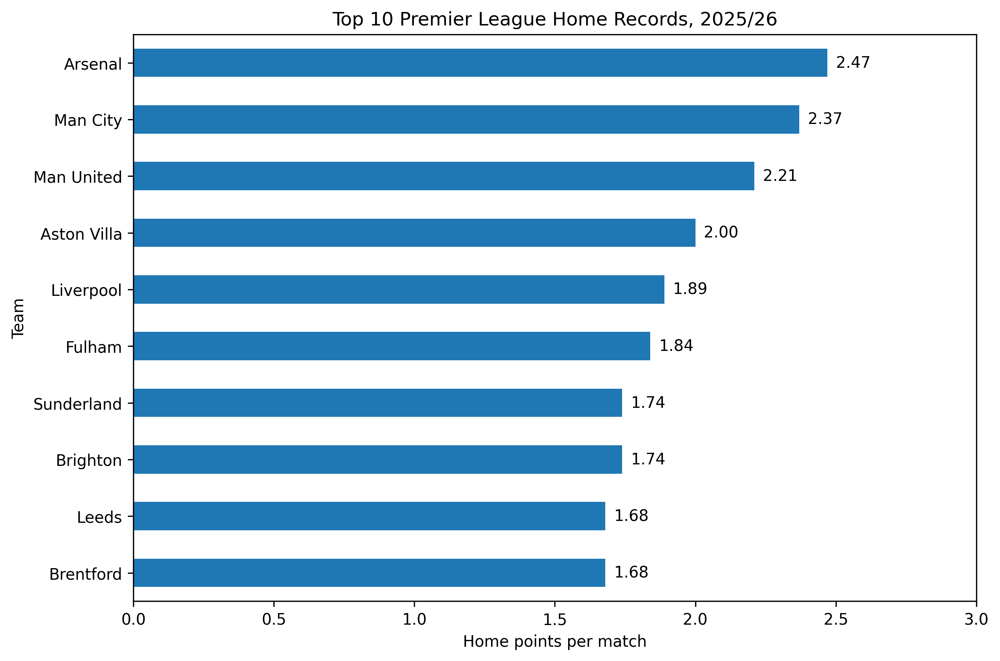

A Python data analysis project examining home advantage in the Premier League across five complete seasons from 2021/22 to 2025/26.

The project uses match-level results to compare home and away performance, examine changes between seasons, and identify the teams with the strongest home records in 2025/26.

## Project Overview

Home advantage is commonly observed in football, with teams often performing better in their own stadium than away from home.

This project investigates whether that pattern is present in recent Premier League seasons by analysing 1,900 matches.

The analysis considers:

- the percentage of home wins, draws and away wins;
- average goals scored by home and away teams;
- changes in home-win percentage between seasons;
- changes in average home goal difference;
- team-level home performance during the 2025/26 season.

## Key Findings

- Home teams won **44.2%** of matches.
- Away teams won **31.9%** of matches.
- Draws accounted for **23.9%** of matches.
- Home teams scored an average of **1.60 goals per match**.
- Away teams scored an average of **1.33 goals per match**.
- The average home goal advantage was approximately **0.27 goals per match**.
- Home-win percentage peaked at **48.4% in 2022/23**.
- Home-win percentage was lowest at **40.8% in 2024/25**.
- Arsenal recorded the strongest home performance in 2025/26, averaging **2.47 home points per match**.

Overall, the analysis provides descriptive evidence of home advantage, although its strength varied considerably between seasons and teams.

## Analytical Interpretation

The results suggest that home advantage remained present throughout the five-season period, but it was not equally strong every year.

The difference between the home-win rate of 44.2% and the away-win rate of 31.9% indicates that home teams were substantially more likely to win. This is reinforced by the average scoring figures, with home teams scoring approximately 0.27 more goals per match.

However, the seasonal results show that home advantage should not be treated as constant. Home-win percentage ranged from 40.8% to 48.4%, while average home goal advantage also varied considerably.

The team-level analysis further demonstrates that league-wide averages can conceal major differences between clubs. Arsenal averaged 2.47 home points per match in 2025/26, substantially outperforming the league-wide home average.

These findings suggest that home advantage is a meaningful feature of Premier League performance, but its strength depends on both the season and the individual team.

## Project Reflection

This project was developed to strengthen my practical Python data-analysis skills and build on my previous academic experience analysing football performance data.

The main technical challenge was combining multiple seasonal datasets into a consistent structure and validating that the recorded results agreed with the underlying scorelines. The project also reinforced the importance of presenting analytical results clearly rather than relying only on calculated statistics.

## Visualisations

### Match Outcomes



### Average Home and Away Goals



### Home-Win Percentage by Season



### Average Home Goal Advantage by Season



### Strongest Home Records in 2025/26



## Technologies Used

- Python
- pandas
- Matplotlib
- Jupyter Notebook
- Git and GitHub

## Dataset

The project uses Premier League match-result CSV files provided by Football-Data.co.uk.

Five complete seasons are included:

- 2021/22
- 2022/23
- 2023/24
- 2024/25
- 2025/26

The original datasets contain match statistics and betting-market variables. Only the following fields were retained for this analysis:

| Field | Description |
|---|---|
| `Date` | Match date |
| `HomeTeam` | Home team |
| `AwayTeam` | Away team |
| `FTHG` | Full-time home goals |
| `FTAG` | Full-time away goals |
| `FTR` | Full-time result |
| `Season` | Premier League season |

Additional variables were created for goal difference, readable result labels, home points and away points.

## Data Validation

Before analysis, the combined dataset was checked for:

- missing values;
- duplicate fixtures;
- invalid result codes;
- inconsistencies between match scores and recorded results;
- incorrect date formats.

No missing values, duplicate matches, invalid result codes or score-result inconsistencies were identified in the selected fields.

## Repository Structure

```text
epl-home-advantage-analysis/
├── data/
│   ├── premier_league_2021_22.csv
│   ├── premier_league_2022_23.csv
│   ├── premier_league_2023_24.csv
│   ├── premier_league_2024_25.csv
│   └── premier_league_2025_26.csv
├── images/
│   ├── average_home_away_goals.png
│   ├── home_goal_advantage_by_season.png
│   ├── home_win_percentage_by_season.png
│   ├── match_outcome_percentages.png
│   └── top_home_teams_2025_26.png
├── notebooks/
│   └── home_advantage_analysis.ipynb
├── .gitignore
├── README.md
└── requirements.txt
```

## Running the Project

2. Create a virtual environment:

```bash
python3 -m venv .venv
```

3. Activate the virtual environment:

On macOS or Linux:

```bash
source .venv/bin/activate
```

On Windows:

```bash
.venv\Scripts\activate
```

4. Install the required dependencies:

```bash
pip install -r requirements.txt
```

5. Start Jupyter Notebook:

```bash
jupyter notebook
```

6. Open the notebook:

```text
notebooks/home_advantage_analysis.ipynb
```

7. Run the notebook from the beginning using:

**Kernel → Restart Kernel and Run All Cells**

## Skills Demonstrated

- Python data analysis
- pandas DataFrame manipulation
- loading and combining multiple CSV files
- data cleaning and validation
- grouping and aggregation
- creation of calculated variables
- descriptive statistical analysis
- data visualisation with Matplotlib
- reproducible analysis using Jupyter Notebook
- version control with Git and GitHub

## Limitations

This project provides descriptive evidence of home advantage but does not establish that playing at home directly causes improved performance.

The analysis does not control for:

- differences in team strength;
- fixture difficulty;
- player availability;
- managerial changes;
- attendance;
- travel distance;
- promoted and relegated teams.

A future extension could use regression analysis to estimate home advantage while controlling for team quality and other relevant factors.

## Author

Harry Jarvis

- Portfolio: [harryjarvis.me](https://harryjarvis.me)
- GitHub: [github.com/harryjarvis](https://github.com/harryjarvis)


